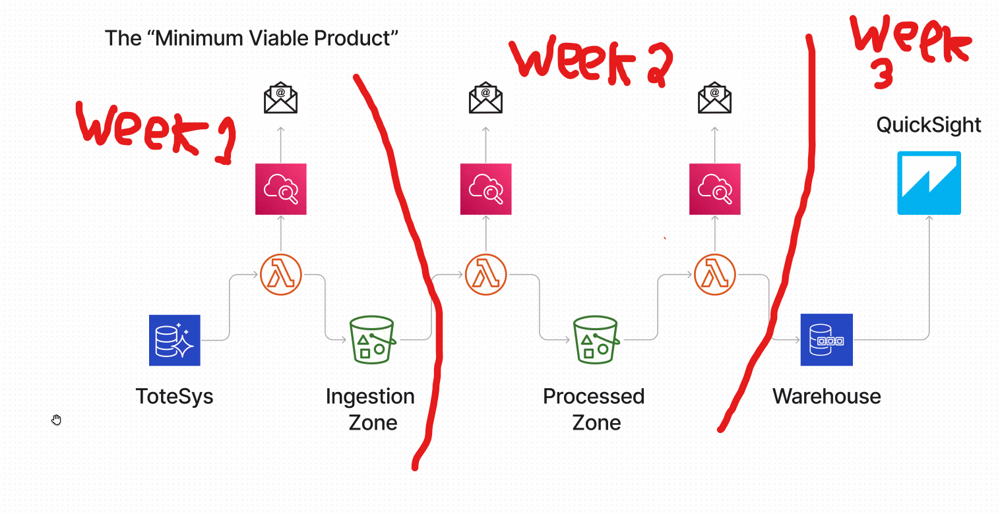

# Project Blackwater - Totesys data extraction and formatting

Team Blackwater has been tasked with reading data from the Totesys remote Database into an AWS S3 Bucket via Lambda python code. This data should then be formatted into another S3 bucket by another Lambda function, and then output to an external Warehouse Database by a final Lambda function. All of the Lambda functions should be properly logged via Cloudwatch. Ultimately, the Database should be entering into Quicksight to show the project progress.

## Installation / Running the Code
The project provides a Makefile which can be run via the Make command. This will download into the local v-env all libraries and packages specified in the requirements.in file. This includes PEP8 compliance such as Black, and security packages such as Bandit and Safety. The v-env needs to be activated manually, as does exporting PYTHONPATH to ensure all the Python files can access the correct functions.

The project also needs a .env file, which is not included in any Git versions. This .env file ensures that a user has the correct permissions to access and run any of the AWS material. The .env should include an aws_access_key_id and aws_secret_access_key variable, which should link to the appropriate IAM user which has the specific permissions.

The IAM user should also be granted ability to view the relevant secrets on the AWS Secret Manager. This is because the credentials to connect to the totesys database (relevant code stored in src/credentials_manager.py), is stored remotely in AWS Secret Manager for security purposes.

The project was agreed to run on Python version 3.11.1, which is stated in the .python-version file.

## SRC
The src file contains all the Python code that is needed for the AWS Lambdas. The Lambdas are stored separately in different subfolders within the src file.

### Extract Lambda

#### connection
Accesses the username, password etc from the secrets manager required to form a connection to the totesys database. The only function, connect_to_db returns a pg8000 native connection to the totesys database.

#### credentials_manager
Using the relevant IAM user access key and secret access key stored in the .env file (see Installation guide), uses boto3 to access aws secrets manager and returns a dictionary containing the totesys connection information. This process is done in the get_secret function. Throws an error if cannot get a connection to the secrets manager.

#### example_update_code
The function update_data_in_bucket takes a table name as an argument. Reads a previous runtime value from the S3 code bucket. If this value is not present, takes a default value of year 1999. The function then compares the previous runtime value to the last_updated time, and if the last_updated is later, then saves the whole sales entry to a list. This list of new info is then written to a new file in the bucket via the write_csv_to_s3 function, with a unique id in the title related to the time the function was run. Finally, the time the function is run is then written to the bucket, overwriting the previous runtime. This ensures that the next instance of the code will know the last run time and will then write only the relevant entries.

#### handler
Contains only 1 function, lambda_handler, which takes a boto3 session as an argument. Using a hard-coded list of table names from the Totesys Database (can be done programatically if need be), for each table in the database, uses the write_csv_to_s3 utility function to write the table data to the specified bucket. The table name is written in as part of the file path to the relevant storage location in the bucket. The function prints a success message if successful, or prints an error message if unsuccessful.

#### utils
The utils file contains all of the utility functions needed to run the code. It contains 4 functions; sql_security, convert_table_to_dict, write_to_s3 and write_csv_to_s3.

The function sql_security takes a table name as an argument. It then connects to the Totesys database using the connect_to_db function, and selects all the table names from the database. As pg8000 attaches many other methods here, the table names are then filtered to give only the wanted values. If the entered table name is in the list of programatically generated table names, the function returns the table name. If not, the function returns a DatabaseError.

The function convert_table_to_dict takes a table name as argument. It first uses sql_security to check if this table name is secure. It the connects to the Totesys database using the connect_to_db function, and runs an sql query to select all data from the table specified as the argument. It zips and collects the data headers and returns the info as a list of dicts. The function throws a DatabaseError if that table name is not accessable in the database.

The function write_csv_to_s3 takes a session, data to be written, bucket name and key (file path to data) as arguments. It uses the wrangler module and to_csv inbuilt functions to write the given data to the specified s3 bucket. The data is converted to a pandas dataframe before entry, and the bucket name and key provide the file path to the stored data. Returns a success message dict on successful write, throws a ClientError and logs the error on a failure.

### Transform Lambda

### Load Lambda

## Terraform
The Terraform file contains all the relevant Terraform files to deploy the Lambdas, S3 buckets, Cloudwatch and IAM users required for the project.

### terraform_alarms
Contains the cloudwatch logs, metrics and filters to handle any errors thrown by any of the Lambdas. When a single error is given by the code, will send an email update to the given email addresses, alerting them to the specific error.

### terraform_events
Creates the scheduler event which will periodically trigger the extract Lambda function to run every 5 minutes. Also connects the scheduler to the relevant rules to allow the scheduler to trigger the lambda function.

### terraform_iam
Creates the extract Lambda role, allowing the Lambda to put objects into the Ingestion Zone S3 bucket. Also creates and attaches the relevant policies and policy documents.

Additionally, creates and attachs the relevant Cloudwatch policies, such as creating log groups and log streams, between the extract lambda and Cloudwatch.

Finally, allows the lambda to access the secrets manager, which takes the secret values to allow the code to access the Totesys database in a secure way.

### terraform_lambda
Creates the extract_lambda function within AWS lambda. Establishes where the extract_lambda pulls it's code from, and the layers available to the lambda. Also establishes where the lambda function should be zipped to, and links the permissions for the extract_lambda to be invoked by eventbridge. Finally, creates an aws wrangler to manage the layers available to the lambda.

### terraform_main
Sets up some of the default parameters for terraform, such as the terraform state bucket, the source and version, the aws regions and logs in with the access key and secret access key provided in the locally-saved .env file.

### terraform_s3
Sets up the buckets which will store the data ingested and transformed by the lambdas. 

### terraform_variable
Gives access to the environment variables for terraform.

## Test

